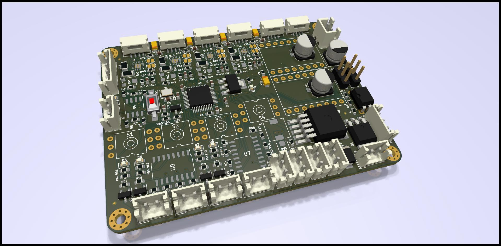

Versatile 4-nozzle PNP head controller
---

This controller was designed to be built into most of DIY pick-n-place machine heads.

### Features:
 - STM32F103C8T6 cheap MCU running on 72MHz
 - RS-485 control port
 - 4 rotary steppers running low-power STSPIN220 drivers
 - 2 up-down steppers running Pololu modules on your taste
 - 4 vacuum sensors to control part presence and place success
 - 4 isolated end-stop ports for home position identification
 - 4 isolated AO3400 MOSFET-driven ports to connect valves, solenoids etc.
 - head top light either WS2812 or LED-strip (5 or 12v)
 - Small size 80x65mm
 - No parts smaller than 0603 so can be hand-built.

### Board render:

### Disclaimer

This project is still in development, and it's not production ready.